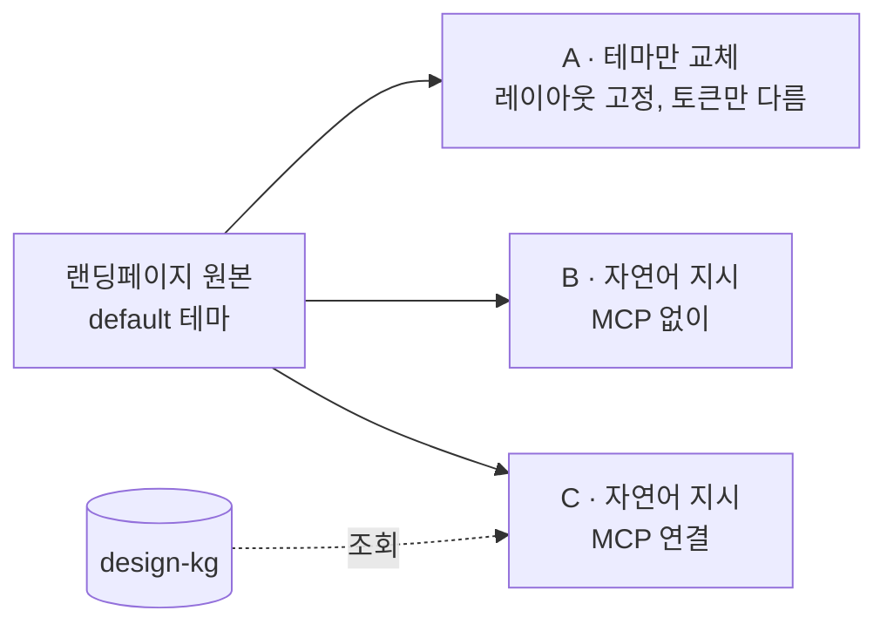
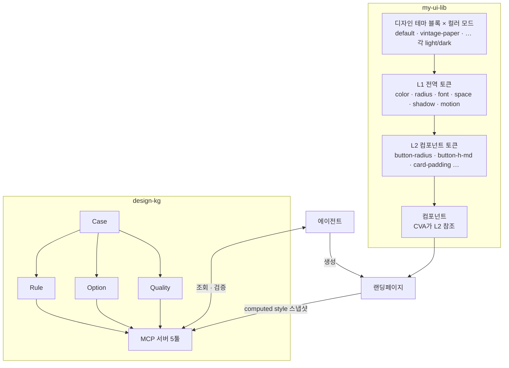
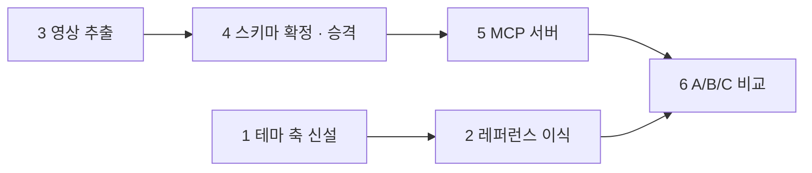

# 디자인 지식그래프 + MCP — 설계

> Work 레포 `.claude/plans/트랙B-디자인-지식그래프.md`(2026-07-30)에서 이식. 2026-09-10 개정.
> 개정 사유는 [바뀐 것](#바뀐-것) 절에 있다.

## Context

참고 문서 세 건이 같은 논지로 수렴한다. 모델을 바꾸는 대신 검증된 지식을 구조화해 에이전트가 조회하게 만들면 성능이 뛴다.

| 출처 | 요지 |
|---|---|
| [Schema 하네스](https://www.aitimes.com/news/articleView.html?idxno=212889) | 모델 가중치 그대로, 실행 프레임워크만 바꿔 ARC-AGI-3 42.83% → 98.98% |
| [graphify](https://news.hada.io/topic?id=31743) | 데이터 → 지식그래프 → LLM 연결. AST 파싱, MCP 서버로 공유 |
| [brunch: 지어내지 말고 찾아 쓰라](https://brunch.co.kr/@kim-yezi/48) | 디자인 AI가 생성에서 조회로. 디자인 시스템이 사람용 문서에서 AI용 운영 입력값으로 |

graphify는 KG를 만들어주는 서비스이고, 이 프로젝트는 그 패턴으로 나올 산출물 하나를 만든다. UI/UX 도메인 지식을 그래프화해 실제 LLM에 붙여 쓰는 툴이다.

### 코퍼스

[Madia Designer](https://www.youtube.com/@UXUIDesign). 한국어, 구독자 약 36.3만, 영상 약 1,120개.

- 포함: 포트폴리오 리뷰, 웹 디자인, 모바일 디자인
- 제외: Photoshop/Illustrator/XD 툴 조작법
- 리뷰 포맷이 핵심 소스다. before/after가 명시적이고 왜 고쳤는지를 말로 설명한다

### 제약

1. 자막만으로는 추출이 안 된다. 강의 화법이 "여기를 이렇게 하면 낫죠?" 식 지시대명사 위주라 화면을 봐야 한다. 프레임 캡처가 필수고 이게 인제스천 단가를 정한다.
2. 저작권. 추출한 규칙(아이디어·사실)은 저작권 대상이 아니지만 자막 전문·원본 스크린샷 저장은 재배포다. 이 레포는 public이므로 그래프에는 추출 결과와 출처 링크(영상 ID + 타임스탬프)만 커밋하고, 캡처 원본은 `.evidence/`에 두고 gitignore한다.

---

## 바뀐 것

원안은 "그래프 붙인 에이전트 vs 안 붙인 에이전트의 CHECKABLE 위반 수"로 판정하려 했다. 개정하면서 세 가지가 달라졌다.

1. **평가 장치가 랜딩페이지 비교로 바뀌었다.** 컴포넌트 하나의 위반 수는 셋업이 주관적이라 결과를 믿기 어렵다. 대신 같은 랜딩페이지를 "과감한 표현으로 새로 그려줘" 같은 자연어 지시로 다시 그리게 하고, MCP 유무에 따라 결과가 어떻게 갈리는지 본다.
2. **`Quality` 노드가 생겼다.** 자연어 지시를 UI 결정으로 번역하려면 형용사 ↔ 속성 매핑이 그래프에 있어야 한다. 한국어 디자인 리뷰의 어휘가 통째로 형용사라 이 코퍼스가 가장 잘 주는 것이기도 하다.
3. **my-ui-lib에 디자인 테마 축이 생긴다.** 비교 대조군이 되는 레퍼런스 테마 여러 종을 한 라이브러리 안에서 갈아끼울 수 있어야 한다. 이건 이 레포가 아니라 my-ui-lib 쪽 작업이지만 이 플랜의 선행 단계라 여기 적는다.

KG가 테마를 직접 조립하는 방향은 검토했다가 버렸다. 버튼 하나에도 크기·플랫폼·문맥에 따라 다른 말이 붙는데 테마 토큰은 단일 값이라 다대일 축약이 필요하고, 그 축약이 개성을 뭉갠다. KG는 지시를 번역하는 층에 머문다.

---

## 목표와 판정

**목표.** 에이전트가 UI를 만들 때 규칙·선택지·형용사의 뜻을 조회하고, 만든 결과를 같은 그래프로 검증하는 폐루프.

**판정.** 동일 랜딩페이지 세 묶음을 나란히 놓는다.



| 기준 | 재는 법 | 뜻 |
|---|---|---|
| 지시 이행률 | `design_qualities("과감한")`이 돌려준 `realized_by` 항목 중 결과물에 실제로 반영된 비율. B도 같은 정의로 잰다 | 1차 지표. 아무것도 안 바꾸면 0, 엉뚱한 걸 바꿔도 0 |
| 재현성 | 같은 지시를 3회 주고 C끼리 / B끼리의 토큰·구조 편차 | 2차 지표. C가 좁고 B가 넓으면 "찾아 쓰기"가 작동한 것 |
| 출처 추적 | C의 변경 각각에 근거 Case ID가 달렸는가 | 달렸으면 지어낸 게 아니다 |
| 기본기 | 대비율·터치타겟 CHECKABLE 통과 | 형용사를 따르다 접근성을 깼는지 |
| 눈 | A/B/C 나란히 보고 지시가 실현됐는지 | 사람 판단 |

이행률이 1차이고 재현성이 2차다. 재현성만 보면 "아무것도 안 하기"나 "무조건 여백만 키우기" 같은 기계적 동작이 최고점을 받는다. 이행률은 그래프가 정의한 방향을 결과물이 실제로 따랐는지를 재므로 그 구멍이 없고, 스냅샷 diff로 자동 계산된다. 이 판정은 6단계이고 이번 플랜 범위 밖이지만, 1~5단계가 전부 여기로 수렴하므로 먼저 적어둔다.

---

## 구조



---

## my-ui-lib 테마 축

### 두 축 분리

지금은 `<html class="light|dark|finance">` 단일 축이고 `finance`라는 디자인 테마가 컬러 모드 자리에 끼어 있다. 둘을 나눈다.

```html
<html data-theme="vintage-paper" data-mode="dark">
```

- `data-theme`: 디자인 테마. `default` · `finance` · 레퍼런스 4종
- `data-mode`: `light` · `dark`. `system`은 ThemeProvider가 `matchMedia`로 둘 중 하나로 풀어서 꽂는다

디자인 테마 하나가 light 블록과 dark 블록 한 쌍을 가진다. 테마 5종이면 토큰 블록 10개다.

`ThemeProvider`는 `mode`·`theme`를 따로 들고 `localStorage` 키도 둘로 나눈다. Storybook 툴바도 `mode`·`theme` 두 개가 된다.

### 토큰 3층

| 층 | 예 | 누가 정하나 |
|---|---|---|
| L1 전역 | `--primary` `--radius` `--font-sans` `--space` `--shadow-*` `--duration-*` `--ease` `--tracking` | 디자인 테마 |
| L2 컴포넌트 | `--button-radius` `--button-h-sm/md/lg` `--button-px-md` `--input-h` `--input-border-w` `--card-radius` `--card-padding` `--card-shadow` | 기본값은 L1에서 파생(`var(--radius)`), 디자인 테마가 덮을 수 있음 |
| Tailwind 매핑 | `@theme inline { --radius-button: var(--button-radius); --spacing-button-md: var(--button-h-md); }` | `index.css`. 지금 `--radius-sm`을 매핑하는 방식 그대로 |
| CVA 클래스 | `rounded-button h-button-md px-button-md` | 컴포넌트 코드. 테마가 건드리지 않음 |

지금 `Button`은 `rounded-full` `h-10` `px-5` `duration-200` `active:scale-[0.97]`을 전부 하드코딩한다. `--radius` 토큰이 있어도 안 쓴다. 이걸 L2 참조로 바꾸는 게 1단계의 실질이다. arbitrary value(`h-[var(--x)]`)는 쓰지 않고 `@theme inline` 매핑을 거쳐 네이티브 유틸리티로 부른다. 새 JS 오버라이드 장치는 만들지 않는다. 디자인 테마는 어디까지나 CSS 변수 블록 하나다.

컴포넌트는 루트 요소에 `data-ui="button"` · `data-variant` · `data-size`를 단다. 5단계 `design_check`가 스냅샷에서 "어느 요소가 버튼인가"를 이걸로 찾는다. 이게 없으면 Rule의 `scope`를 렌더 결과에 대응시킬 방법이 없다.

L1에 새로 생기는 축은 `space`(기준 간격) · `shadow`(color/opacity/blur/spread/offset 여섯 값) · `motion`(`--duration-fast/normal`, `--ease`) · `tracking`이다. tweakcn 프리셋이 정의하는 축과 맞추되 모션은 tweakcn에 없어서 우리가 정한다.

L2 토큰은 전 컴포넌트에 만들지 않는다. 1단계에서는 코퍼스가 말이 많을 컴포넌트(Button · Input · Card · Badge · Dialog)부터 두고, 3단계 추출 결과를 보고 넓힌다.

### 무엇이 테마가 아닌가

"버튼은 리스트 안에서는 ghost로"처럼 variant를 고르는 구조 판단은 테마가 못 담는다. 그건 KG의 Rule/Option으로 남고, 페이지를 생성하는 에이전트가 조회해서 적용한다. 테마는 값을 정하고, KG는 선택을 정한다.

### 레퍼런스 테마

| 이름 | 결 | 출처 |
|---|---|---|
| `default` | 지금 my-ui-lib light/dark. Apple 계열 | 기존 |
| `finance` | 기존 finance 테마를 디자인 테마 자리로 이동 | 기존 |
| `vintage-paper` | 잉크·종이 | tweakcn |
| `mocha-mousse` | 따뜻한 | tweakcn |
| `neo-brutalism` | 각지고 강한 | tweakcn |
| `claymorphism` | 둥글고 부드러운 | tweakcn |

[tweakcn](https://github.com/jnsahaj/tweakcn)은 Apache-2.0이고 프리셋마다 light/dark · font 3종 · radius · shadow 6값 · letter-spacing · spacing을 정의한다. 우리 L1과 거의 일치한다. 이름은 tweakcn 것을 그대로 써서 출처를 남긴다. 4종은 서로 결이 갈리도록 고른 것이고 착수 시 바꿔도 된다. `default`가 반드시 들어가야 한다. MCP 디자인은 Base UI 기본 구현 위에 얹히는 것이라 "아무것도 안 한 상태"가 기준선으로 필요하다.

---

## 지식그래프

### 왜 사례 → 승격인가

영상에서 규칙 문장을 직접 뽑으려 하면 안 나온다. 채널이 규칙을 명제로 말하지 않는다. 반면 "이 리뷰에서 뭘 지적했고 어떻게 고쳤나"는 잘 나온다. 그래서 추출은 사례만 하고, 규칙·선택지·형용사 매핑은 데이터가 만들게 한다. `Projects/ontology-pipeline`의 순서(스키마 → 매핑 → 게이트)를 그대로 따른다. 스키마 먼저, 인제스천 자동화는 나중이다.

### 노드

**`Case`** — 영상에서 추출한 단일 지적/개선 사례.

```yaml
id: case-001
source: { video: <id>, t: "04:12" }
scope:
  component: button        # button | input | card | list | nav | hero | typo | color | …
  platform: mobile         # mobile | web | any
  size: any                # sm | md | lg | any
  variant: any             # primary | ghost | outline | any
  context: list            # list | hero | form | modal | any
property: touch-target     # spacing | size | color | contrast | hierarchy | radius | shadow | motion | …
direction: up              # up | down | set | other. 화자가 값을 키우라/줄이라/특정값으로/구조 변경
problem: 무엇이 문제였나
fix: 어떻게 고쳤나
rationale: 왜 (영상에서 말한 이유)
stance: PRESCRIPTIVE       # PRESCRIPTIVE | PREFERRED | OPTION
quote: "터치 영역은 무조건 44 이상 잡으셔야 돼요"
qualities: []              # 화자가 쓴 형용사. 예: [밋밋한→과감한]
measured: { prop: touch-target, value: 44, unit: px }   # 수치 언급 시에만
evidence: .evidence/<video>/0412.png
```

`scope`가 원안보다 넓어졌다. 버튼 하나에도 크기·플랫폼·문맥에 따라 다른 말이 붙으므로 조건을 정식 필드로 둔다. 모르는 조건은 `any`다. `direction`은 승격 게이트가 `(component, property, 방향)`으로 묶을 때 쓰는 그 방향이다.

`qualities`는 화자가 쓴 형용사를 `현재→목표` 쌍으로 적는다. "너무 밋밋해요, 좀 더 과감하게"면 `밋밋한→과감한`. Quality 노드의 원료다.

`stance`는 화자 어조다.

| stance | 한국어 어미 단서 | 뜻 |
|---|---|---|
| `PRESCRIPTIVE` | "~해야 됩니다" "무조건" "반드시" "절대" | 규칙 후보 |
| `PREFERRED` | "~하는 게 좋아요" "훨씬 낫죠" "추천드려요" | 선택지에 recommended 표시 |
| `OPTION` | "~해볼까요?" "취향이에요" "이럴 수도 있고" | 선택지 |

어조는 확신도이지 타당성이 아니다. 개인 취향일수록 더 단호하게 말하는 경향이 있어서, 어조가 반복 게이트를 대체하지 않는다.

**`Rule`** — 승격된 규칙. 검증에서 위반 판정 대상.

```yaml
id: rule-007
statement: 모바일 터치 타겟은 최소 44px
grade: CHECKABLE           # CHECKABLE | JUDGMENT
source: corpus             # corpus | standard  (standard = WCAG · HIG 등 명문 규격과 일치)
standard_ref: null         # source가 standard일 때 조항. 예: "WCAG 2.2 SC 2.5.8"
scope: { component: any, platform: mobile }
state: default             # default | focus-visible. 스냅샷의 어느 상태에서 판정하나
check: "Math.min(el.box.width, el.box.height) >= 44"   # CHECKABLE만. 스냅샷 요소 el에 대한 JS 식
promoted_from: [case-001, case-014, case-032]
confidence: 3
```

**`Option`** — 어느 쪽을 골라도 틀리지 않는 선택지 카탈로그. 검증에서 판정하지 않는다.

```yaml
id: option-003
question: 카드 모서리 처리
scope: { component: card }
choices:
  - { label: 라운드 8px, when: "친근·모바일", recommended: true, cases: [case-021, case-047] }
  - { label: 직각, when: "정보 밀도·데스크톱", cases: [case-055] }
```

**`Quality`** — 형용사가 어떤 속성을 어느 방향으로 움직이는가. 검증에서 판정하지 않고, 자연어 지시를 번역하는 데 쓴다.

```yaml
id: quality-bold
label: 과감한
aliases: [대담한, 강한, 임팩트 있는]
realized_by:
  - { property: type-scale, direction: up, scope: { context: hero }, weight: 2, cases: [case-012, case-088] }
  - { property: whitespace, direction: up, weight: 2, cases: [case-044, case-071] }
  - { property: contrast,   direction: up, weight: 1, cases: [case-031] }
opposes: quality-subtle
```

`direction`은 `up | down | set`이고 `set`이면 `value`를 같이 둔다. 형용사 동의어 묶기(`aliases`)는 사람이 한다. 한 형용사가 여러 속성을 가리킬 때 무엇을 적용할지는 에이전트가 고른다. 그래프는 `weight` 순으로 정렬하고 `scope`로 걸러서 줄 뿐이다. 다 적용하라는 뜻이 아니고, 6단계 이행률은 "몇 개를 골랐든 그게 목록 안에 있었는가"를 잰다.

**`Component`** · **`Property`** · **`Video`** — 묶는 축. 조회 진입점.

### 엣지

- `Case -[EXEMPLIFIES]-> Rule` · `Case -[ILLUSTRATES]-> Option` · `Case -[REALIZES]-> Quality`
- `Rule -[APPLIES_TO]-> Component` · `Rule -[ABOUT]-> Property`
- `Rule -[CONFLICTS_WITH]-> Rule` — 여백 확보 vs 정보 밀도처럼 규칙은 충돌한다. 숨기지 않고 조회 시 같이 돌려준다
- `Quality -[OPPOSES]-> Quality`
- `Case -[FROM]-> Video`

### 승격 게이트

축 하나는 반복(서로 다른 영상 몇 개에서 나왔나), 다른 하나는 어조다. 둘은 직교하므로 조합으로 판정한다.

| | OPTION / PREFERRED 우세 | PRESCRIPTIVE 우세 |
|---|---|---|
| 영상 3개 이상 | `Option` | `Rule` |
| 영상 1~2개 | Case로만 보관 | Case로만 보관 |

1. 서로 다른 영상 3개 이상의 Case가 같은 `(component, property, 방향)`을 지적하면 후보
2. stance 다수결로 목적지 결정. PRESCRIPTIVE 우세일 때만 `Rule`, 그 외는 `Option`
3. Rule 후보 중 `measured` 있는 Case 2개 이상이고 값이 일치·근접하면 `CHECKABLE`, `check` 식 작성. 서술만이면 `JUDGMENT`
4. stance가 팽팽히 갈리면 `Option`으로 내리고 `promotion-log.md`에 사유를 남긴다
5. 내용이 서로 반대면 `CONFLICTS_WITH`로 잇고 양쪽 다 노출한다
6. 명문 규격이 어조를 이긴다. Case 내용이 WCAG · 플랫폼 HIG의 조항과 일치하면 stance와 반복 수에 관계없이 `Rule`로 올리고 `source: standard`를 단다. "이렇게 하시는 게 좋아요"라고 부드럽게 말한 접근성 규칙이 Option으로 떨어지는 걸 막는다. 반대로 단호했지만 규격에 없는 것은 기존 게이트를 그대로 탄다
7. `Quality`는 별도 게이트다. 같은 형용사(동의어 포함)가 서로 다른 영상 3개 이상에서 같은 `(property, direction)`과 함께 나오면 `realized_by` 항목으로 승격. 형용사는 지시이지 규칙이 아니라 stance를 보지 않는다. 항목의 `weight`는 근거 Case 수다
8. 승격 확정은 사람이 한다. 1차는 전량 수동

### 저장 형식

YAML 파일과 로딩 스크립트. 영상 20개면 수백 노드 규모라 GraphDB는 과잉이다. 다중 홉 질의가 실제로 필요해질 때 옮긴다.

```
design-kg/
  docs/plan.md                 이 문서
  docs/schema.md               4단계 산출물. 노드·엣지·승격 규칙 확정판
  kg/
    videos.yaml                코퍼스 목록 + 선별 사유
    cases/*.yaml
    rules.yaml
    options.yaml
    qualities.yaml
    promotion-log.md
  mcp/                         TypeScript, @modelcontextprotocol/sdk, stdio
  scripts/
    validate.ts                Case YAML 스키마 검증
    snapshot.ts                Playwright로 페이지 computed style 덤프 → design_check 입력
  .evidence/                   gitignore
```

---

## MCP 툴 5개

| 툴 | 입력 | 출력 |
|---|---|---|
| `design_rules` | scope (component · platform · size · variant · context) | 조건 맞는 Rule. CHECKABLE 우선, CONFLICTS_WITH 동봉 |
| `design_options` | scope | 선택지 카탈로그 + recommended 표시 |
| `design_qualities` | 형용사 (동의어 허용), scope 선택 | 움직일 property·direction·근거 Case를 `weight` 순으로. 해당 scope의 Rule과 `opposes` 동봉 |
| `design_cases` | rule_id · option_id · quality_id | 근거 사례 before/after 요약 + 출처 링크 |
| `design_check` | computed style 스냅샷 (`scripts/snapshot.ts` 출력) | Rule만 판정. CHECKABLE은 `check` 식 실행, JUDGMENT는 scope가 맞는 요소 하나씩 근거 사례를 붙여 LLM 판정 |

조회는 넓게(Rule + Option + Quality), 검증은 좁게(Rule만). 에이전트에게 줄 정보는 많을수록 좋지만 위반으로 때릴 근거는 단호한 것만이어야 한다.

`design_check`의 입력을 코드가 아니라 스냅샷으로 둔 이유: `min(width,height) >= 44` 같은 식은 렌더 결과에서만 판정된다. 코드 정적 분석은 Tailwind 클래스 조합을 다 못 따라간다. `scripts/snapshot.ts`는 Playwright로 Storybook 또는 랜딩페이지를 열어 JSON을 뽑는데, 범위를 세 가지로 좁힌다.

- 요소: `data-ui`가 달린 것만. `data-ui` · `data-variant` · `data-size`가 그대로 Rule `scope` 매칭 키가 된다
- 속성: bounding box · color · font · radius · shadow · spacing(padding/gap)만. 페이지 전체 computed style을 다 담으면 JUDGMENT 판정 때 LLM 컨텍스트가 터진다
- 상태: 인터랙티브 요소는 `default`와 `focus-visible` 두 상태를 잡는다. 포커스 링 규칙이 검증 대상에 들어오게 하기 위해서다. hover는 2차

---

## 단계

이번 플랜은 1~5단계다. 6단계는 별도 플랜으로 쓴다.

의존 관계는 선형이 아니다. 1~2단계(my-ui-lib)와 3~4단계(design-kg)는 서로 독립이고, 5단계가 3~4를 기다린다. 착수 순서는 3단계가 먼저다. KG 데이터가 쌓여야 MCP를 만들 수 있고, 테마 축은 6단계 판정 전까지만 있으면 된다.



### 1단계 — my-ui-lib 테마 축 신설

레포: my-ui-lib. `data-theme` × `data-mode` 분리, L1 확장, L2 컴포넌트 토큰(Button · Input · Card · Badge · Dialog)과 `@theme inline` 매핑, CVA를 네이티브 유틸리티로 전환, 같은 5개 컴포넌트에 `data-ui` · `data-variant` · `data-size` 부착, ThemeProvider · Storybook 툴바 2축화. `finance`를 디자인 테마로 이동.

ThemeProvider는 옛 `ui-theme` 키를 첫 실행에 한 번 읽어 옮긴다. `light` · `dark`면 mode로, `finance`면 `theme=finance, mode=dark`로. 옮긴 뒤 옛 키는 지운다.

검증: 기존 테스트 통과. Storybook에서 `default` × light/dark가 지금과 픽셀 단위로 같은가(회귀). 툴바 두 개가 독립으로 동작하는가.

### 2단계 — 레퍼런스 테마 이식

레포: my-ui-lib. tweakcn 4종 토큰을 우리 L1 이름으로 옮기고 `docs/themes.md`에 출처를 남긴다.

검증: 5종 × 2모드 = 10블록이 Storybook에서 전부 렌더되고, Button · Input · Card 모양이 테마마다 실제로 달라 보이는가(L2가 작동한다는 증거). 대비율 스크립트로 10블록의 foreground/background 비율을 재서 `docs/themes.md`에 기록한다. 4.5:1 미달은 단계 실패가 아니라 6단계 기본기 판정에서 쓸 기준선 데이터다.

### 3단계 — 영상 20개 추출

레포: design-kg. 선별 기준은 두 가지다. before/after가 있는 리뷰이고, 화자가 형용사로 방향을 지시하고 그 결과를 화면으로 보여주는 것. 선별 목록과 사유는 `kg/videos.yaml`.

추출은 LLM 보조 반자동이다. 자막 + 프레임 캡처를 주고 Case 초안을 받아 사람이 검수한다. 툴을 만들지 않고 그때그때 돌린다.

검증: 전 Case가 `scripts/validate.ts`를 통과. `qualities`가 비어 있지 않은 Case 비율. `measured`가 있는 Case 수.

### 4단계 — 스키마 확정 + 승격

레포: design-kg. 승격 게이트를 수동으로 돌리고 `docs/schema.md`를 확정한다.

검증: Quality 5개 이상이고 각각 `realized_by` 2개 이상. 이게 통과 조건이다. `source: corpus`인 CHECKABLE Rule 수는 기록만 한다.

Quality 문턱을 못 넘으면 코퍼스 선별이 틀린 것이다. 3단계로 돌아가 선별 기준을 고친다. corpus CHECKABLE이 0~2개면 채널이 단호하게 말하지 않는 스타일이라는 뜻이고, 그건 결론이지 실패가 아니다. 검증용 Rule은 `source: standard`가 맡고 이 채널은 Option · Quality 공급원으로 역할을 좁힌다.

### 5단계 — MCP 서버

레포: design-kg. 5툴, YAML 로딩, stdio. `scripts/snapshot.ts`.

검증: Claude Code에 붙여 `design_qualities("과감한")` → `design_rules(hero)` → 컴포넌트 하나 생성 → `snapshot` → `design_check` 왕복 1회가 도는가. 왕복 기록을 `docs/roundtrip-01.md`에 남긴다.

### 6단계 — 랜딩페이지 A/B/C 비교 (별도 플랜)

my-ui-lib으로 랜딩페이지 한 벌을 만들고 [판정](#목표와-판정)을 돌린다.

---

## 다른 트랙과의 관계

- **트랙 C(Base UI 전환)** — 완료. 1단계가 그 위에서 시작한다.
- **트랙 D(HTML 편집 익스텐션)** — 익스텐션이 `design_check`를 부르는 그림이 가능하지만 엮지 않는다. 6단계 판정 뒤에 본다.
- **트랙 A(온톨로지 강의)** — 스키마 → 매핑 → 게이트 순서를 빌려 쓴다.

## 미해결

- 영상 20개 구체 선별은 3단계 착수 시 채널을 훑어 정한다.
- `check` 식의 표현 언어. 1차는 JS 표현식 문자열을 스냅샷 객체에 `Function`으로 평가하는 정도로 두고, 규칙이 늘면 다시 본다.
- L2 토큰을 어느 컴포넌트까지 넓힐지는 3단계 결과를 보고 정한다.
- my-ui-lib의 `tailwind.config.js`는 v3 방식 color 확장이 남아 있는데 v4는 CSS(`@theme`)로 설정하므로 사실상 죽은 파일이다. 이 플랜 범위는 아니고, 1단계 착수 때 별도로 정리할지 정한다.
