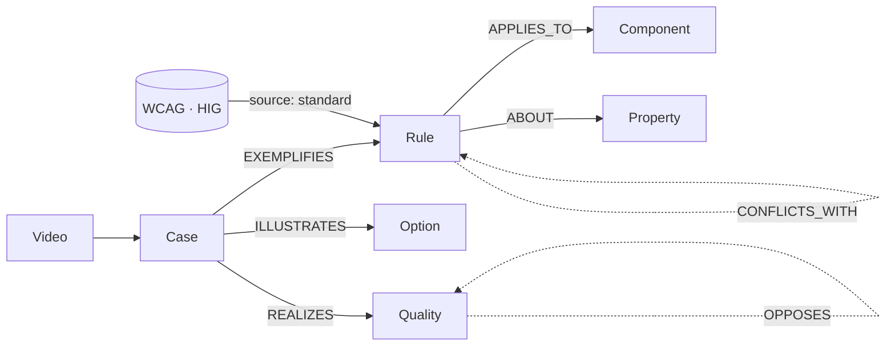

# 스키마 확정판

> 4단계(Task 7~8) 산출물. `docs/plan.md`의 "지식그래프" 절을 실제로 승격을 돌려 본 결과로 고쳐 쓴 것이다.
> 이후 인제스천은 plan.md가 아니라 이 문서를 기준으로 한다. 2026-09-11.

정의의 근거는 `src/schema.ts`(zod)이고, 이 문서는 그 스키마를 왜 그렇게 썼고 어휘를 어디까지
인정하는지를 적는다. 승격 결정 하나하나는 `kg/promotion-log.md`에 있다.

## 노드와 엣지

`Case`가 유일한 1차 자료다. `Rule` · `Option` · `Quality`는 Case를 게이트에 통과시켜 만든 2차
산출물이고, 예외는 `source: standard` Rule 셋뿐이다. 규격 Rule은 Case 없이도 존재한다.

엣지는 별도 파일이 아니라 필드로 저장한다. `Rule.promoted_from` · `Option.choices[].cases` ·
`Quality.realized_by[].cases`가 Case를 가리키고, `Rule.conflicts_with`와 `Quality.opposes`가
같은 종류끼리 잇는다. `src/load.ts`가 로딩 시 이 참조를 전부 검사한다.

## scope

다섯 축이다. 모르는 값은 `any`이고, 조회 시 `any`는 모든 값과 맞는다.

| 축 | 값 |
|---|---|
| `component` | 아래 컴포넌트 어휘 |
| `platform` | mobile · web · any |
| `size` | sm · md · lg · any |
| `variant` | primary · secondary · ghost · outline · any (자유 문자열) |
| `context` | list · hero · form · modal · nav · any (자유 문자열) |

`size`는 242개 Case 전부가 `any`이고 `variant`도 238개가 `any`다(ghost · outline · primary 4건만
예외). 리뷰 영상에서 화자가 "sm 버튼"처럼 변형을 지목하는 일이 거의 없었다. 축은 스키마에 남기되,
인제스천에서 채우려고 애쓸 필요는 없다. `context`는 반대로 잘 채워졌다 — any 78 · list 73 ·
hero 31 · form 29 · nav 28 · modal 3.

## 컴포넌트 어휘 최종

`kg/components.yaml`의 `kg` 값이 정본이다. 아래는 실제 Case에 나온 횟수다
(`grep -h "component:" kg/cases/*.yaml | sort | uniq -c`).

| component | cases | my-ui-lib 매핑 |
|---|---|---|
| card | 43 | Card · StatCard · PreviewCard |
| typo | 35 | (매핑 없음. 타이포 전반) |
| layout | 22 | (매핑 없음. 화면 배치) |
| button | 19 | Button · Toggle · ToggleGroup |
| nav | 18 | Header · Sidebar · NavigationMenu · Toolbar |
| image | 18 | (매핑 없음. 썸네일·사진·3D) |
| icon | 12 | Icon |
| hero | 11 | (매핑 없음. 첫 화면 영역) |
| any | 9 | (컴포넌트를 특정 못 한 지적) |
| list | 8 | ScrollArea |
| input | 6 | Input · Textarea · NumberField · OtpField · Autocomplete · Combobox · Label · Fieldset |
| checkbox | 6 | Checkbox · CheckboxGroup · RadioGroup · Switch |
| chart | 6 | PieChart |
| badge | 5 | Badge · Tag |
| avatar | 5 | Avatar |
| select | 4 | Select · DropdownMenu · ContextMenu · Menubar |
| modal | 4 | Dialog · AlertDialog · Drawer |
| structure | 4 | (매핑 없음. 화면 단위 정보구조) |
| accordion | 3 | Accordion · Collapsible |
| table | 2 | Table · DataTable |
| form | 2 | Form |
| color | 0 | (매핑 없음) |
| popover · tooltip · tabs · progress · toast · separator | 0 | Popover · Tooltip · Tabs · Progress · Meter · Slider · Toaster · Separator |

`color`는 컴포넌트가 아니라 property로 쓰였다. 어휘에는 남겨 두되 Case에서는 쓰지 않는다.
아래 여섯(popover 이하)은 라운드 1에서 다루는 영상을 못 찾았다. 자세한 사정은 `docs/coverage.md`.

`layout` · `typo` · `image` · `hero` · `structure`는 my-ui-lib 컴포넌트로 매핑되지 않는다.
Case 수로는 90건, 전체의 37%다. 승격은 되지만 `promoted coverage` 분모(컴포넌트 이름 48개)에는
잡히지 않는다. 커버리지 수치를 읽을 때 이 점을 감안해야 한다.

## property 어휘 최종

실제로 쓰인 direction 분포와 `measured` 단위다.

| property | cases | direction (건수) | measured 단위 |
|---|---|---|---|
| structure | 60 | other 60 | 없음 |
| size | 27 | down 16 · up 8 · set 2 · other 1 | px |
| type-scale | 21 | down 11 · up 9 · other 1 | px |
| whitespace | 18 | up 12 · down 4 · other 2 | px |
| alignment | 16 | other 14 · set 2 | 없음 |
| color | 16 | other 13 · down 3 | 없음 |
| contrast | 11 | other 5 · down 4 · up 2 | px (대비를 폰트 크기와 같이 말한 1건) |
| hierarchy | 11 | other 8 · down 2 · up 1 | 없음 |
| affordance | 8 | other 8 | 없음 |
| spacing | 8 | set 3 · other 3 · up 2 | px · % |
| labeling | 8 | other 8 | 없음 |
| weight | 7 | other 4 · down 3 | 없음 |
| density | 6 | down 5 · other 1 | 없음 |
| radius | 6 | other 3 · down 2 · set 1 | px |
| interaction | 5 | other 5 | 없음 |
| shadow | 5 | other 3 · down 2 | 없음 |
| touch-target | 5 | up 5 | px |
| line-height | 2 | set 1 · down 1 | % |
| motion | 1 | other 1 | 없음 |
| saturation | 1 | down 1 | 없음 |

`structure` · `interaction` · `affordance` · `labeling`은 JUDGMENT 전용이다. `measured`를 쓰지 않고
`direction`은 `other`로 둔다. `docs/extraction-guide.md`에서 정한 그대로이고 이번 라운드에서 예외가
없었다. `hierarchy`는 그 목록에 없어서 up · down이 3건 섞여 있는데, 셋 다 "위계를 낮춘다/높인다"라는
서술이지 수치가 아니다. 다음 라운드에서 `hierarchy`도 JUDGMENT 전용으로 넣을지 정해야 한다.

`direction`이 `other`인 Case가 140건, 전체의 58%다. `other`인 Case는 CHECKABLE Rule이 될 수 없다.
`Quality.realized_by`에는 들어갈 수 있다(2026-09-11 스키마 변경). 구조를 바꾸라는 조언도 형용사가
가리키는 실체이므로, 방향이 없다는 이유로 버리면 이 코퍼스에서 형용사가 가장 많이 달리는 지적을
통째로 버리게 된다.

규격 Rule 전용으로 `focus` 하나를 더 쓴다(rule-003). 코퍼스에는 없는 property다.

## stance 판정

최종 판정 표다. `quote`에 근거 어미가 그대로 들어 있어야 한다.

| stance | 어미 |
|---|---|
| PRESCRIPTIVE | ~해야 됩니다 · ~하면 안 돼요 · 무조건 · 반드시 · 절대 · 필수 · ~있어야 돼요 · ~하셔야 돼요 · ~해야 돼요 · ~하면 안 되죠 |
| PREFERRED | ~하는 게 좋아요 · 훨씬 낫죠 · 추천드려요 · ~하면 더 · ~하시는 게 · ~하는 게 맞아요/맞죠 · ~하면 좋겠어요 · ~가 낫죠 · ~하시면 돼요 · ~해야 될 것 같아요 |
| OPTION | ~해볼까요 · ~해도 되고 · 취향이에요 · 이럴 수도 있고 · 상황에 따라 · ~정도로만 · ~해 볼게요/줄여 볼게요 · ~하도록 하고요 |

추출 중 헷갈렸던 세 가지와 결정:

**의무 표면형.** `해야/돼야/되어야 + 되다/하다` 꼴이면 표면형이 달라도 PRESCRIPTIVE다.
`~해야 돼요` · `~돼야 돼요` · `~되어야 합니다` · `~돼야 되는 거예요`가 전부 같은 판정이다.
어미 목록을 문자열로 외우면 매번 새 표면형에 걸린다.

**의무 + 것 같다.** `~해야 될 것 같아요`처럼 의무 표현에 `것 같다`가 붙으면 PREFERRED다.
의무를 말하되 확신을 뺀 것이라 규칙 후보로 올리지 않는다. 영상에서 꽤 자주 나오는 꼴이고,
이 판정 하나로 PRESCRIPTIVE 수가 눈에 띄게 줄었다.

**-겠- 혼잣말.** `~해야겠구나`처럼 -겠-이 붙은 혼잣말은 지시가 아니라 PRESCRIPTIVE가 아니다.
화자가 자기 화면을 만지며 중얼거리는 장면이 많아서 이게 없으면 과대 계상된다.

242개 Case의 분포는 OPTION 139 · PRESCRIPTIVE 54 · PREFERRED 49다. 어조는 확신도이지
타당성이 아니므로, 어조만으로 규칙을 만들지 않고 반복 게이트와 조합해서 쓴다.

## qualities 정규화

`Case.qualities`는 `현재→목표` 쌍이다. 화자가 실제로 쓴 평가어만 적고, 한쪽을 안 말했으면 `?`를 쓴다.

- 한쪽이 `?`면 나머지 한쪽만 후보가 된다. 둘 다 실제 형용사면 두 후보로 쪼갠다
- `polarity: problem`은 "이 인상을 없애려면"이고 `target`은 "이 인상을 내려면"이다.
  `답답한→?`은 problem 후보, `?→깔끔한`은 target 후보다
- 같은 인용문에 형용사를 여러 개 쓰면 그대로 여러 개 적는다. 다만 뜻이 겹치는 말을 나열한 것뿐이면
  (예: "심플하게, 깔끔하게") 하나만 남긴다. case-612에서 `?→깔끔한`을 빼고 `?→심플한`만 남긴 것이 이 경우다
- 동의어 묶기는 승격 단계에서 한다. Case에는 화자가 쓴 말을 그대로 두고, `Quality.label`과
  `aliases`로 대표어를 정한다. 이번 라운드의 병합은 `부담스러운→큰`,
  `빡빡한 · 촘촘한→답답한`, `벙벙한→넓은`, `혼란스러운→복잡한`이다
- 한 형용사가 문제 쪽과 목표 쪽 양쪽으로 쓰이면 alias로 묶지 않는다. `타이트한`은 문제
  (`타이트한→?`, 영상 3개)와 목표(`넓은→타이트한`, 영상 2개) 양쪽에 나온다. 묶으면
  "타이트하게 해 주세요"라는 목표 지시에 여백을 넓히라는 정반대 답이 나간다. 목표 쪽이 문턱을
  못 넘어 양쪽 다 승격하지 않고 Case로만 뒀다. 묶기 전에 그 형용사가 반대 극성으로도 쓰이는지 본다
- `Quality.realized_by[].direction`은 `up | down | set | other`다. `other`는 "수치를 올리고 내리는
  게 아니라 구조를 바꾼다"는 뜻이고, `structure` · `hierarchy` · `alignment` 계열 형용사가 여기 들어온다.
  `set`일 때만 `value`가 필수인 것은 그대로다. 1차 승격에서는 `other`가 없어 `복잡한\|structure`
  같은 후보가 막혔고, 2차에서 열었다
- `other` 항목을 읽는 쪽(에이전트)은 "어느 방향으로 얼마나"가 아니라 근거 Case의 `fix`를 봐야 한다.
  `design_qualities`가 `cases`를 같이 돌려주는 이유다

## 승격 게이트 — 실제로 적용한 형태

1. 서로 다른 영상 3개 이상의 Case가 같은 `(component, property, direction)`을 지적하면 후보
2. stance 다수결로 목적지를 정한다. PRESCRIPTIVE가 나머지 합보다 많을 때만 `Rule`
3. **팽팽 규칙** — PRESCRIPTIVE가 나머지 합과 같거나 1 차이면 Rule 후보라도 `Option`으로 내린다.
   이번에 card\|structure(4 대 3)와 card\|whitespace(2 대 1)가 여기 걸렸다
4. Rule 후보 중 `measured`가 있는 Case가 2개 이상이고 값이 중앙값 ±10% 안이면 `CHECKABLE`,
   아니면 `JUDGMENT`. 판정은 `src/candidates.ts`의 `valuesAgree`가 한다
5. **주장 동일성 확인** — 게이트를 넘은 뒤에도, 묶인 Case들이 같은 주장을 하는지 사람(또는 판정
   에이전트)이 읽고 확인한다. 영상 수는 같은 주장의 반복일 때만 뜻이 있다. `any\|structure\|other`가
   여기서 보류됐다. `any`나 `structure` 같은 넓은 버킷은 서로 무관한 지적이 모여 3을 채우기 쉽다
6. 한 후보에서 서로 다른 질문이 보이면 Option을 둘로 쪼갠다. 어느 질문에도 안 붙는 Case는
   미채택으로 두고 로그에 남긴다. 억지로 choice를 만들지 않는다
6-1. choice의 `label`과 `when`은 인용한 Case가 실제로 말한 것을 넘지 않는다. Case가 반대를 말하는데
   조건만 뒤집어 붙이거나, 같은 Case를 서로 반대인 두 choice에 걸치게 두지 않는다. 근거를 빼서
   choice가 하나만 남으면 Option 자체를 보류한다(`card\|structure`가 이 경우다).
   Case 하나에만 기대는 Option은 `question`에 "(영상 N개 · 문턱 미만, 선택지 서술용)"을 적는다
7. 명문 규격이 어조를 이긴다. WCAG · 플랫폼 HIG 조항과 맞으면 반복 수·어조와 무관하게 `Rule`,
   `source: standard` · `standard_ref`를 단다. 일치하는 Case가 없어도 규격 Rule은 추가한다
8. `Quality`는 별도 게이트다. 같은 형용사(동의어 포함)가 서로 다른 영상 3개 이상에서 같은
   `(property, direction)`과 나오면 `realized_by` 항목이 된다. stance를 보지 않는다.
   `weight`는 근거 Case 수다. 동의어를 묶은 뒤 영상 수를 다시 센다
9. `Rule.confidence`는 `promoted_from` 길이다. 규격 Rule에 인용 Case가 없으면 0
10. 결정은 셋 중 하나다. 승격 · 강등(Rule 후보를 Option으로) · 보류. 애매하면 Rule보다 Option,
    Option보다 보류. 모든 행을 `kg/promotion-log.md`에 이유와 함께 남긴다

## CHECKABLE `check` 식

스냅샷 요소 `el`(`scripts/snapshot.ts` 출력)에 대한 JS 식이다. 헬퍼 `num` · `contrast`는
`design_check` 구현이 제공한다.

| property | check |
|---|---|
| touch-target (≥N px) | `Math.min(el.box.width, el.box.height) >= N` |
| contrast (≥R) | `contrast(el.style.color, el.style['background-color']) >= R` |
| radius (= N px) | `Math.abs(num(el.style['border-radius']) - N) <= 1` |
| font-size (≥N px) | `num(el.style['font-size']) >= N` |
| line-height (≥N × font) | `num(el.style['line-height']) >= num(el.style['font-size']) * N` |
| padding (≥N px, 네 변 최소) | `Math.min(...['top','right','bottom','left'].map(s => num(el.style['padding-' + s]))) >= N` |
| focus ring (state: focus-visible) | `num(el.style['outline-width']) >= 2 && el.style['outline-style'] !== 'none'` |

표에 없는 property는 식을 지어내지 말고 `JUDGMENT`로 내린다.

`state`는 스냅샷의 어느 상태에서 판정하는지다. `default`가 기본이고, 포커스 링 판정만
`focus-visible`이다. 스냅샷도 같은 상태 이름으로 요소를 담는다.

## 이 코퍼스가 말하는 것과 말하지 않는 것

**코퍼스 Rule이 하나도 없다.** 영상 3개 이상 후보 14건 중 stance 다수결이 Rule로 간 것은 3건이고,
그중 하나는 팽팽으로 강등돼 Option이 됐고 둘은 보류됐다. 후보 14건의 최종 집계는
승격 10 · 강등 1 · 보류 3이고 Option 12개가 나왔다. 이 채널은 지적을 단호하게 하지 않는다는
뜻이 아니라(PRESCRIPTIVE가 54건 있다), 같은 지적을 여러 영상에서 단호하게 반복하는 일이 드물다는
뜻이다. 단호한 말은 대개 그 화면에만 해당하는 일회성 지적이다.

**CHECKABLE은 코퍼스에서 나올 수 없었다.** 영상 3개 이상 후보 가운데 `measured` 값이 일치한 그룹이
하나도 없다. `typo\|type-scale\|up`은 13 · 14 · 16 · 16px, `typo\|type-scale\|down`은
15 · 20 · 18 · 14px이다. 화자가 수치를 말할 때는 그 화면의 맥락에 맞춘 값이라 그룹 안에서 흩어진다.
수치가 겹친 유일한 그룹은 `checkbox\|touch-target\|up`(28 · 28px)인데 영상 2개라 문턱을 못 넘었고,
그 값 자체도 WCAG의 44px과 어긋난다.

따라서 `docs/plan.md` 4단계가 예고한 분기대로 간다. 검증용 CHECKABLE Rule은 `source: standard`가
맡고, 이 채널은 `Option`과 `Quality` 공급원이다. 6단계 이행률 지표는 Quality로 재고, 기본기 지표는
규격 Rule로 잰다. 둘의 출처가 분리돼 있는 편이 오히려 판정에 낫다.

**Quality 문턱은 절반만 넘었다.** 노드는 5개로 조건을 채웠고, `realized_by` 2개 이상은 2개로
조건(각 2개)에 못 미친다. cramped · loose · cluttered가 각 1항목이다. 숫자를 채우려면 근거 없는
항목을 지어내야 해서 채우지 않았다.

1차에서는 노드가 4개였다. `realized_by.direction`이 `other`를 안 받아 영상 4개짜리
`복잡한\|structure\|other`가 통째로 막혔기 때문인데, 2026-09-11에 스키마를 고쳐 열었고
quality-cluttered가 승격됐다. 남은 미달은 스키마가 아니라 근거 수다 — cramped의 두 번째 조합은
`spacing\|up`(영상 2개), cluttered의 두 번째 조합은 `density\|down`(영상 2개)으로 각각 하나가
모자란다. 항목 문턱을 영상 2개로 낮춰도 `realized_by` 2개 이상인 노드는 4개까지만 는다.

다음 라운드에서 이 조건을 넘기려면 `structure` 지적을 더 잘게 쪼개 수치 방향이 있는 property로
같이 적거나, 코퍼스 선별 기준을 고쳐 수치·방향을 말하는 영상을 더 넣어야 한다.

**승격된 형용사는 전부 problem 쪽이다.** target 형용사는 어느 `(property, direction)`도 영상 3개를
못 넘었다. 화자는 무엇이 잘못됐는지는 같은 말로 반복해서 지적하지만("크다" 7개 영상, "답답하다"
6개 영상), 무엇을 목표로 삼는지는 매번 다른 말을 쓴다(깔끔한 · 심플한 · 통일된 · 균형 잡힌 ·
과감한 · 시원한 · 여유로운이 각각 영상 1~2개). 그래서 `design_qualities("과감한")` 같은 질의는
지금 그래프로는 답이 안 나온다. 반대로 `design_qualities("답답한")`은 답이 나온다. 6단계 지시
문구를 정할 때 이 비대칭을 감안해야 한다.

**포커스와 키보드 접근성 Case가 0건이다.** 채널이 모바일 화면과 시각 위계를 다루기 때문이다.
rule-003은 `promoted_from`이 비어 있고 `confidence: 0`이다.

**게이트가 컴포넌트로 쪼개면서 놓친 주제가 있다.** "이미지 위에 텍스트를 겹치지 마라"는 지적은
card(case-1402 · case-303)와 image(case-1007 · case-802)에 흩어져 있어, 합치면 영상 4개인데
`(component, property, direction)` 그룹으로는 어느 쪽도 3개를 못 넘거나 다른 주장과 섞인다.
컴포넌트를 가로지르는 주제를 잡으려면 `component: any`로 묶는 2차 그룹이 필요하다. 이번 라운드는
게이트를 그대로 따랐고, 이 주제는 승격하지 않았다.

**미커버 컴포넌트는 8개다.** Progress · Meter · Slider · Popover · Tooltip · Tabs · Toaster ·
Separator. 승격 기준으로는 더 좁아서 `promoted coverage`가 23%(11/48)다. Rule · Option · Quality가
가리키는 컴포넌트는 button · card · nav · avatar 넷뿐이고, 나머지 승격분은 my-ui-lib 컴포넌트로
매핑되지 않는 `typo` · `layout` · `image`에 걸려 있다.
